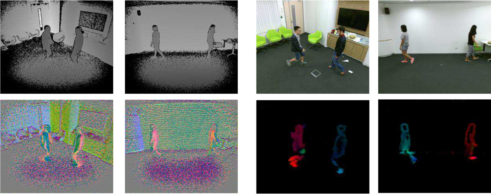

# Exploiting Spatio-Temporal Representation for 3D Human Action Recognition from Depth Map Sequences
This repository is an implementation of "Exploiting Spatio-Temporal Representation for3D Human Action Recognition from Depth Map Sequences".

## Installation
1. Clone the repository
`https://github.com/xp-ji/DOGV-ST3D`
2. Install python dependencies
- Create conda environment with dependencies: `conda env create -f environment.yml`
- Activate the environment: `conda activate dogv`

## Quick Start
1. Download required dataset, for example NTU_RGB+D from the [ROSE webpage](http://rose1.ntu.edu.sg/Datasets/actionRecognition.asp). Your dataset structure should look like
```
ntu_rgb+d/
    depth/
    ...
    S001C003P008R001A045/
        Depth-00000001.png
        ...
        Depth-00000054.png
    ...
    depth_masked/
        ...
        S001C003P008R001A045/
            MDepth-00000001.png
            ...
            MDepth-00000054.png
        ...
```
2. Download the model weights from [Google Drive](https://drive.google.com/drive/folders/1CmdxU6kqEY8jE6xYESwXvci9bHY6EGEL?usp=sharing) and put the `*.pth` files in `weights`.
3. Run the command
```
python test_model.py --arch Resnet3d --dataset NTU_RGBD  --intype DOGV --exp X-Sub --weights "weights/NTU_RGBD_Resnet3d_X-Sub_DOGV.pth" 
```
The test result will be saved in `logs/Test_NTU_RGBD_Resnet3d_X-Sub_DOGV`.

## Re-implementation
### Prepare datasets
Download all needed dataset, i.e., NTU-RGB+D, PKU-MMD and UOW_combined3D
### Training the model from scratch

```
python train_model.py --dataset NTU_RGBD --arch Resnet3d --intype RDMs --exp X-Sub
```

## Citation
If you find this code useful for your research, please use the following BibTeX entry.
```
@article{ji2021exploiting,
  title={Exploiting spatio-temporal representation for 3D human action recognition from depth map sequences},
  author={Ji, Xiaopeng and Zhao, Qingsong and Cheng, Jun and Ma, Chenfei},
  journal={Knowledge-Based Systems},
  pages={107040},
  year={2021},
  publisher={Elsevier}
}
```


